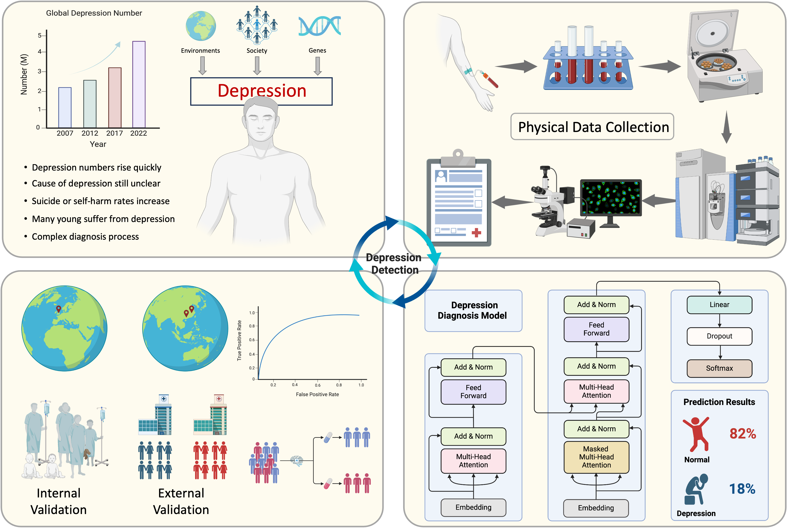

# Artificial intelligence-based system for major depression disorder diagnosis via blood routine and biochemistry tests: A large-scale, multinational, multicenter, and retrospective cohort study

## Introduction

Major depressive disorder (MDD) is a highly prevalent and debilitating mental health condition that affects over 300 million individuals worldwide, posing significant emotional, physical, and socioeconomic challenges. Despite its profound burden, MDD remains underdiagnosed and undertreated due to limited awareness and the complexity of its clinical diagnosis. Recent studies have suggested that routine blood tests, including biochemical and hematological parameters, may provide valuable insights into the pathophysiology of MDD. However, their diagnostic utility remains underexplored. This study introduces DepCLS, an artificial intelligence-based diagnostic framework designed to distinguish individuals with MDD from healthy controls using clinical indicators derived from routine blood tests. We retrospectively analyzed large-scale, real-world data from multinational, multicenter cohorts, with the primary dataset sourced from the UK Biobank for model development and validation. Representative clinical indicators were selected through a combination of feature selection techniques and Mendelian randomization. DepCLS was trained and evaluated using state-of-the-art machine learning and deep learning models, and its performance was benchmarked against several established algorithms. The DepCLS model demonstrated robust diagnostic performance, achieving an accuracy of 86.57%, an F1 score of 0.7768, and an area under the receiver operating characteristic curve (AUC) of 0.8883 (95% CI: 0.8804–0.8961) on the internal validation dataset. External validation was conducted using two independent cohorts, yielding AUCs of 0.8863 (95% CI: 0.8666–0.9060) and 0.9376 (95% CI: 0.9226–0.9526), respectively. These results highlight the generalizability and reliability of DepCLS in diverse populations and clinical settings. The findings underscore the potential of DepCLS as an accessible, cost-effective, and accurate diagnostic tool for MDD, leveraging data from routine blood tests commonly available in clinical practice. In addition to its diagnostic utility, the identification of key clinical indicators may provide novel insights into the biological underpinnings of MDD, paving the way for improved understanding and management of this complex disorder.

## Two external validation corhorts

We collected external validation cohorts from two large hospitals in China, named the ZH Cohort and the GX Cohort. For the ZH cohort, we screened blood routine tests and related depression diagnoses for 1,596 patients from a large dataset. These patients visited the Third People's Hospital of Zhuhai between January 2020 and August 2024. Since substantial data were missing for certain participants, we ultimately selected 1,180 cases (600 with MDD and 580 without MDD) to conduct extensive experiments. Similarly, the GX Cohort consists of 1,268 individuals who visited the People's Hospital of Guangxi Zhuang Autonomous Region between March 2021 and August 2024. After thorough analysis, 1,120 patients met the data collection criteria. Specifically, this cohort includes 536 participants diagnosed with MDD and 584 individuals without MDD.

**Notable:** If you are interseted in our project or dataset, please contact with us (syyshayuyang@163.com).
